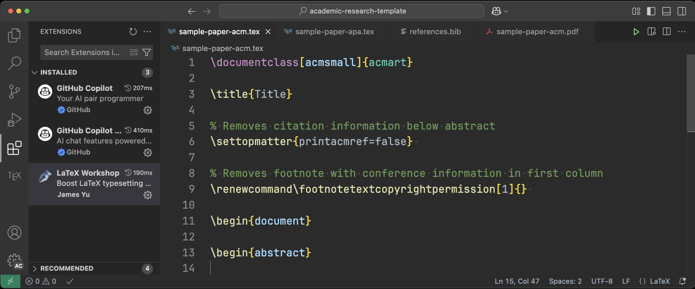

# Academic Research Template

# Introduction



Whether you're building new web infrastructure or creating a document preparation system, the first step is to gather the minimum operating system and compilation requirements and create the simplest version of the project.

The Academic Research Template assists with writing papers in ACM or APA format using LaTeX.

LaTeX is designed to simplify reference management and automate many aspects of academic writing. By setting it up to work with VSCode and applying formatting, you can streamline your workflow. Additionally, using Copilot can help manage and improve your scripts.

# Installation

Install [LaTeX](https://latex-project.org/get) or [MacTeX](https://www.tug.org/mactex/) if you are using macOS. You can install it via Homebrew using the command:  

```sh
brew install --cask mactex
```

To enable automatic formatting for LaTeX documents, install `latexindent`, a Perl-based formatter, using the following command:  

```sh
brew install latexindent
```  

This tool is essential for maintaining clean and consistent LaTeX code. After installation, ensure that your LaTeX Workshop extension in VS Code is configured to use `latexindent` for auto-formatting.

Install the VS Code extension [LaTeX Workshop](https://marketplace.visualstudio.com/items?itemName=James-Yu.latex-workshop) (you can create a new VS Code profile dedicated to academic research).

Configure the relevant auto-compile and auto-format LaTeX Workshop settings in VS Code.

```json
"[latex]": {
  "editor.defaultFormatter": "James-Yu.latex-workshop"
},
"latex-workshop.formatting.latex": "latexindent",
"[bibtex]": {
  "editor.defaultFormatter": "James-Yu.latex-workshop"
}
```

# Usage

When you open a .tex file, you can click the "Build LaTeX Project" button at the top right of the document to see the resulting PDF.